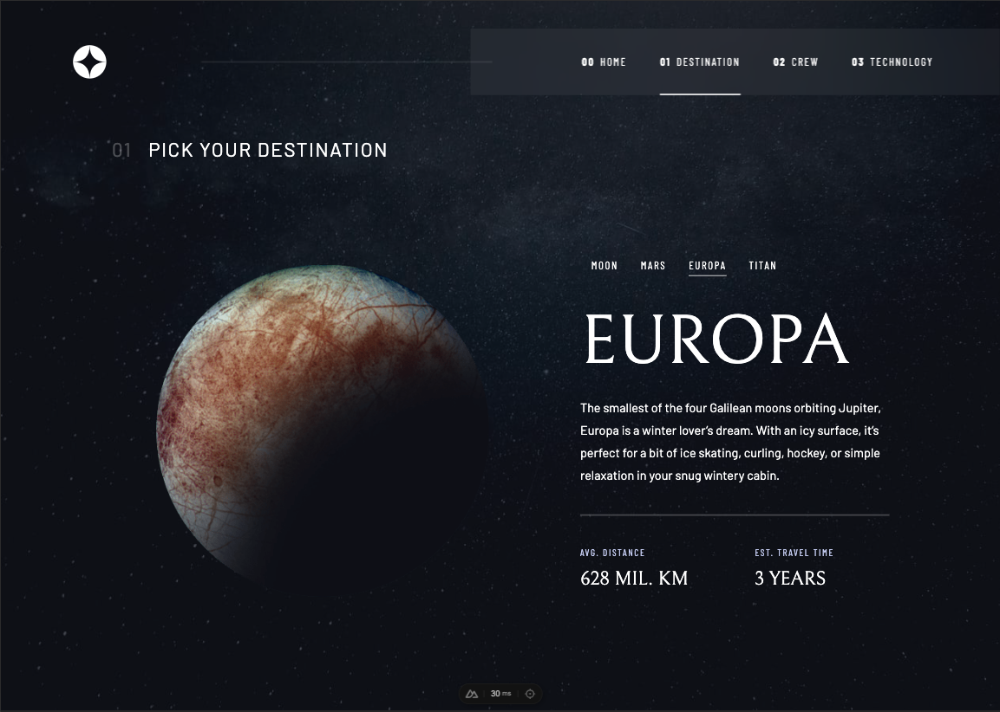
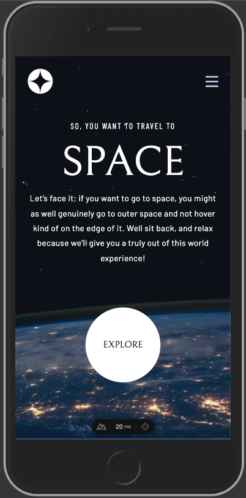

# Frontend Mentor - Space tourism website solution

This is a solution to the [Space tourism website challenge on Frontend Mentor](https://www.frontendmentor.io/challenges/space-tourism-multipage-website-gRWj1URZ3). Frontend Mentor challenges help you improve your coding skills by building realistic projects.

### The challenge

Users should be able to:

- View the optimal layout for each of the website's pages depending on their device's screen size
- See hover states for all interactive elements on the page
- View each page and be able to toggle between the tabs to see new information

### Links

- Solution URL: [https://www.frontendmentor.io/solutions](https://www.frontendmentor.io/solutions/space-tourism-website-with-nuxt-and-tailwind-OEwlwURi1f)
- Live Site URL: [https://frontend-mentor-space-tourism-frida.netlify.app/](https://frontend-mentor-space-tourism-frida.netlify.app/)

### Screenshot

### Built with

- Flexbox
- Mobile-first workflow
- Tailwind CSS
- Nuxt / Typescript
